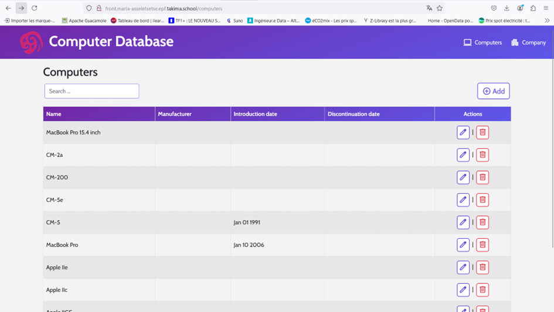

# Formation Kubernetes

Bienvenue dans mon dépôt Git qui regroupe les travaux pratiques réalisés dans le cadre de ma formation sur Kubernetes. Ce document présente une vue d'ensemble des trois TPs, ainsi que leur objectif, leur structure, et les étapes clés de chaque exercice.

## Introduction

Ce dépôt contient les trois TP axés sur la découverte, l’approfondissement et l’implémentation de GitOps avec Kubernetes. Chacun des TP a pour but de me familiariser avec les concepts fondamentaux et avancés de Kubernetes, en passant par le déploiement d’applications, la gestion de clusters, et la mise en œuvre de pratiques DevOps avec GitOps.

## Contenu du dépôt
Le dépôt est structuré de manière à séparer chaque TP dans son propre répertoire. Voici un aperçu de ce que vous trouverez :

1. **Day 1 - Discovery (TP-kube-01)**  
     
   Ce premier TP est une introduction à Kubernetes. Il m’a permis de comprendre les bases de Kubernetes, comme l'installation et l'utilisation de `kubectl`, ainsi que la gestion des premières ressources (Pods, Deployments, Services).  

   * Extrait d'un resultat

    


2. **Day 2 - Deep Dive (TP-kube-02)**  
    
   Ce TP va plus loin dans l'utilisation de Kubernetes avec un focus sur les opérateurs et les Custom Resources Definitions (CRD). J'ai également manipulé des concepts tels que les StatefulSets et l’intégration d'outils de monitoring. En plus de cela, j'ai mis en œuvre un déploiement complet en architecture trois tiers. Cette approche comprenait les éléments suivants :

    Le front :
    Il s'agit d'une application web (hébergée dans un conteneur Nginx), accessible via un service exposé à l'extérieur du cluster Kubernetes. Ce service gère les requêtes des utilisateurs et transmet ces demandes à l'API. J'ai configuré un fichier front-config.yaml pour gérer les variables nécessaires, comme l'URL de l'API, et j'ai aussi créé un front-deployment.yaml pour gérer le déploiement du frontend.

    L'API :
    C'est l'élément central de la logique applicative. Mon API était basée sur Spring Boot, et je l'ai déployé via un api-deployment.yaml. L'API est exposée via un Ingress qui permet d'accéder à ses endpoints depuis le frontend.

    La base de données :
    Pour gérer la persistance des données, j'ai déployé une base de données Postgres en utilisant un StatefulSet et un volume persistant. Cela a assuré que même si le Pod Postgres est redémarré, les données ajoutées par l'API (comme les enregistrements ajoutés depuis le frontend) sont conservées grâce au PVC (Persistent Volume Claim).

    Ces trois composants (Front, API et Base de données) communiquent entre eux via des services Kubernetes internes. Pour chaque service, j'ai créé les fichiers de configuration nécessaires pour les exposer, les déployer et garantir leur bonne communication dans le cluster Kubernetes​

   * Extrait d'un resultat




3. **Day 3 - GitOps (TP-kube-03)**  
   
   Ce dernier TP porte sur l'implémentation de GitOps avec ArgoCD et Helm. J’ai appris à automatiser le déploiement continu en utilisant Git comme source de vérité pour l'état du cluster Kubernetes.  

   * Extrait d'un resultat

 


## Comment utiliser ce dépôt

1. **Cloner le dépôt** :
   ```bash
   git clone https://github.com/mariaVictoire/EPF-MDE-Kubernetes-ASSELE-Maria.git

   ```
2. **Configurer Kubernetes** :  
   Assurez-vous que `kubectl` est installé et que vous avez accès à un cluster Kubernetes pour tester les configurations.
   
3. **Installer les dépendances** :  
   - Helm est requis pour le TP GitOps.
   - ArgoCD est nécessaire pour la synchronisation GitOps.
   
   Vous pouvez installer Helm via :
   ```bash
   sudo apt-get install helm
   ```

4. **Déploiement** :  
   Pour chaque TP, naviguez dans le dossier correspondant et appliquez les ressources Kubernetes :
   ```bash
   kubectl apply -f <fichier.yaml>
   ```

## Conclusion

Ce dépôt regroupe l'ensemble de mes expériences avec Kubernetes au travers de ces trois TPs. Chaque TP m’a permis de consolider mes compétences dans l’administration de clusters Kubernetes et l’implémentation de pratiques GitOps pour des déploiements continus.

N’hésitez pas à me contacter si vous avez des questions ou suggestions sur l’un de ces exercices.

---
