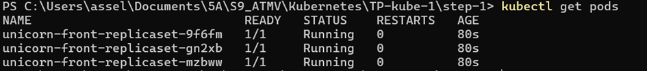
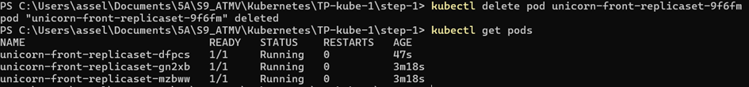
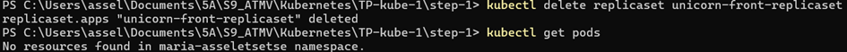

# TP1: Discovery of Kubernetes

## Objectif

L'objectif de ce TP était de découvrir Kubernetes, apprendre à configurer les outils, comprendre les principales ressources (Pods, Deployments, Services, etc.), et les gérer à l'aide de la CLI `kubectl`. Ce projet m'a permis de mieux comprendre comment déployer, scaler, et gérer des applications containerisées dans Kubernetes.

## Installation des outils

1. **kubectl** : L'outil principal pour interagir avec Kubernetes via la ligne de commande. J'ai suivi les étapes pour l'installation sur [Linux/MacOS](https://kubernetes.io/docs/tasks/tools/install-kubectl-linux/), et vérifié que la version installée était correcte via :
   ```bash
   kubectl version --client
   ```

2. **kubeconfig** : J'ai utilisé un fichier `kubeconfig` pour configurer l'accès au cluster Kubernetes. 

````
Il contient les informations nécessaires pour se connecter au cluster, comme le serveur API et les certificats.

````

3. **Lens** : Pour une gestion visuelle des ressources Kubernetes, j'ai installé OpenLens, qui offre une interface pratique pour observer les ressources créées dans le cluster.


## Manipulation des Pods

### Création d'un Pod
- Un Pod est l'unité de base dans Kubernetes. J'ai démarré un Pod `mynginx` avec l'image Nginx via la commande suivante :
   ```bash
   kubectl run mynginx --image=nginx
   ```
   Cela a créé un Pod dans le namespace personnel.

### Suppression du Pod
- Une fois le Pod créé, j'ai pu le supprimer avec la commande :
   ```bash
   kubectl delete pod mynginx
   ```

🧠 **Réponse:** En observant le fichier YAML généré pour un Pod, j'ai découvert que chaque ressource Kubernetes contient des propriétés comme `apiVersion`, `kind`, `metadata`, et `spec`. Ces propriétés décrivent la ressource et son comportement.


## Impératif Vs Déclaratif


🧠 **Réponse:** Je me suis rendu compte que Kubernetes renvoie une erreur. Cela est dû au fait qu'un pod avec le nom mynginx existe déjà. Avec l'approche impérative, Kubernetes tente de créer immédiatement une nouvelle ressource avec le nom donné. Comme chaque nom de pod doit être unique dans un même namespace, la duplication échoue. Cela m'a fait comprendre qu'avec l'impératif, il n'y a pas de gestion intelligente des doublons ou de mise à jour d'une ressource existante.


🧠 **Réponse:** J'ai constaté que Kubernetes ne renvoie pas d'erreur comme avec l'impératif. Au lieu de cela, il vérifie si le pod existe déjà et applique seulement les modifications nécessaires, s'il y en a. S'il n'y a aucune différence entre l'état actuel et celui que j'ai décrit dans le fichier YAML, Kubernetes ne fait rien. J'ai vraiment apprécié cette approche car elle permet de décrire l'état voulu et de laisser Kubernetes gérer les changements sans risquer d'écraser ou de dupliquer les ressources.


## ReplicaSets et Deployments

### Scaler les Pods avec un ReplicaSet
- Pour garantir la haute disponibilité, j'ai utilisé un ReplicaSet qui permet de gérer plusieurs instances d'un même Pod.
🧠 **Réponse:** La propriété selector: matchLabels est utilisée pour faire correspondre les pods avec le label app: unicorn-front. Cela signifie que le ReplicaSet gère uniquement les pods qui ont ce label spécifique.




🧠 **Réponse:** Après le déploiement du ReplicaSet, il y a 3 pods déployés dans le namespace, conformément à la configuration replicas: 3 dans le fichier YAML.






🧠 **Réponses:** Lorsque je supprime un pod, le ReplicaSet détecte qu'il manque un pod et en crée immédiatement un nouveau pour maintenir le nombre spécifié de répliques. Et, en supprimant le ReplicaSet, les pods qu'il gérait sont également supprimés, car il ne reste plus d'objet pour les superviser et maintenir leur état.


###  Deployment
- J'ai ensuite utilisé un `Deployment` pour gérer les réplicas et les versions des Pods. Le Deployment permet de mettre à jour les Pods sans interruption de service grâce à un processus de **RollingUpdate**. Le fichier YAML d’un Deployment est similaire à celui d’un ReplicaSet, mais inclut des stratégies de déploiement.

🧠 **Réponses:** Le Deployment gère le cycle de vie des Pods, facilite les RollingUpdates pour les mises à jour sans interruption, et permet des Rollbacks plus facilement. Il crée automatiquement des ReplicaSets lors des déploiements.

🧠 **Réponses:** Le nombre de ReplicaSets dépend du nombre de versions déployées (au moins 1 pour chaque version déployée). Le nombre de Pods est défini par le paramètre replicas dans le Deployment, ici il est de 3 Pods actifs.


🧠 **Réponses:** Après le RollingUpgrade, il y aura deux ReplicaSets : un pour l'ancienne version et un pour la nouvelle. Cependant, seul le ReplicaSet correspondant à la nouvelle version aura des Pods actifs, généralement le nombre spécifié dans replicas (ex : 3 Pods).

🧠 **Réponses:** Les logs montrent les étapes de mise à jour des Pods, comme la suppression des anciens Pods et le démarrage des nouveaux avec la nouvelle image. Si tout se passe bien, les nouveaux Pods passent au statut Running et l'ancienne version est progressivement déclassée.


### Faire un Rollback

🧠 **Réponses:** Les nouveaux Pods ne démarrent pas car l'image nginx:1.91-falseimage est incorrecte ou n'existe pas. Kubernetes attendra le déploiement des Pods mais ceux-ci resteront en échec.


🧠 **Réponses:** Il y aura deux révisions : la révision précédente (version stable) et la nouvelle tentative échouée avec l'image incorrecte.

🧠 **Réponses:** Le champ CHANGE-CAUSE enregistre la raison ou le détail du changement effectué, par exemple le changement d'image lors du déploiement.


### Mettre à l'échelle

🧠 **Réponses:** Après avoir scalé le déploiement à 5 réplicas, il y aura 5 Pods en cours d'exécution pour l'application nginx.

### Mettre en standby un deployment

🧠 **Réponses:** Lorsqu'on met un Deployment en pause, le ReplicaSet ne change pas. Aucun nouveau Pod n'est créé ou supprimé tant que le déploiement reste en pause.

🧠 **Réponses:** Lorsqu'on reprend le Deployment, les mises à jour (comme le changement d'image) sont appliquées et le ReplicaSet commencera à déployer les nouveaux Pods en fonction des modifications.


## Bonus

## Publication des Services

### Exposition des Pods avec un Service
- Un **Service** dans Kubernetes agit comme un load balancer interne qui distribue le trafic aux Pods. J'ai créé un Service pour exposer mes Pods Nginx sur le port 80 :


- Ce Service de type `ClusterIP` permet à d'autres applications dans le cluster de communiquer avec `nginx`.

### Utilisation d'un Ingress
- Pour exposer mes Pods au-delà du cluster (par exemple, sur Internet), j'ai utilisé un **Ingress** qui agit comme un reverse proxy.


## Gestion des ConfigMaps et Secrets

### ConfigMap
- J'ai utilisé un ConfigMap pour gérer des configurations sous forme de variables d'environnement dans mes Pods, par exemple pour personnaliser la couleur de fond d'une application web.


### Secret
- Les **Secrets** permettent de gérer des données sensibles, comme les identifiants pour les accès à un registry privé.


## Conclusion

Ce TP m'a permis de mieux comprendre les concepts essentiels de Kubernetes, tels que la gestion des Pods, des ReplicaSets, des Deployments, des Services et des Ingress. J'ai également appris à utiliser des outils comme `kubectl` pour gerer mes ressources. Kubernetes facilite le déploiement et la scalabilité des applications tout en garantissant la haute disponibilité et la résilience grâce à ses mécanismes de rolling updates et d'auto-scaling.

