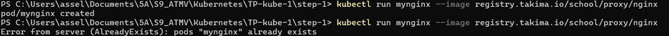
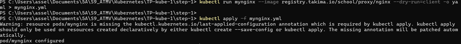

# TP1: Discovery of Kubernetes

## Objectif

L'objectif de ce TP était de découvrir Kubernetes, apprendre à configurer les outils, comprendre les principales ressources (Pods, Deployments, Services, etc.), et les gérer à l'aide de la CLI `kubectl`. Ce projet m'a permis de mieux comprendre comment déployer, scaler, et gérer des applications containerisées dans Kubernetes.

## Installation des outils

1. **kubectl** : L'outil principal pour interagir avec Kubernetes via la ligne de commande. J'ai suivi les étapes pour l'installation sur [Linux/MacOS](https://kubernetes.io/docs/tasks/tools/install-kubectl-linux/), et vérifié que la version installée était correcte via :
   ```bash
   kubectl version --client
   ```

2. **kubeconfig** : J'ai utilisé un fichier `kubeconfig` pour configurer l'accès au cluster Kubernetes. 

````
Il contient les informations nécessaires pour se connecter au cluster, comme le serveur API et les certificats.

````

3. **Lens** : Pour une gestion visuelle des ressources Kubernetes, j'ai installé OpenLens, qui offre une interface pratique pour observer les ressources créées dans le cluster.


## Manipulation des Pods

### Création d'un Pod
- Un Pod est l'unité de base dans Kubernetes. J'ai démarré un Pod `mynginx` avec l'image Nginx via la commande suivante :
   ```bash
   kubectl run mynginx --image=nginx
   ```
   Cela a créé un Pod dans le namespace personnel.

### Suppression du Pod
- Une fois le Pod créé, j'ai pu le supprimer avec la commande :
   ```bash
   kubectl delete pod mynginx
   ```

````
- En observant le fichier YAML généré pour un Pod, j'ai découvert que chaque ressource Kubernetes contient des propriétés comme `apiVersion`, `kind`, `metadata`, et `spec`. Ces propriétés décrivent la ressource et son comportement.

````

**Réponse:** <font color="green">Utilisez la commande suivante dans votre terminal : </font> 

## Impératif Vs Déclaratif




````
Je me suis rendu compte que Kubernetes renvoie une erreur. Cela est dû au fait qu'un pod avec le nom mynginx existe déjà. Avec l'approche impérative, Kubernetes tente de créer immédiatement une nouvelle ressource avec le nom donné. Comme chaque nom de pod doit être unique dans un même namespace, la duplication échoue. Cela m'a fait comprendre qu'avec l'impératif, il n'y a pas de gestion intelligente des doublons ou de mise à jour d'une ressource existante.

````




````
J'ai constaté que Kubernetes ne renvoie pas d'erreur comme avec l'impératif. Au lieu de cela, il vérifie si le pod existe déjà et applique seulement les modifications nécessaires, s'il y en a. S'il n'y a aucune différence entre l'état actuel et celui que j'ai décrit dans le fichier YAML, Kubernetes ne fait rien. J'ai vraiment apprécié cette approche car elle permet de décrire l'état voulu et de laisser Kubernetes gérer les changements sans risquer d'écraser ou de dupliquer les ressources.
````

## ReplicaSets et Deployments

### Scaler les Pods avec un ReplicaSet
- Pour garantir la haute disponibilité, j'ai utilisé un ReplicaSet qui permet de gérer plusieurs instances d'un même Pod. Voici un exemple de fichier YAML pour un ReplicaSet :
   ```yaml
   apiVersion: apps/v1
   kind: ReplicaSet
   metadata:
     name: mynginx-replicaset
   spec:
     replicas: 3
     selector:
       matchLabels:
         app: nginx
     template:
       metadata:
         labels:
           app: nginx
       spec:
         containers:
         - name: nginx
           image: nginx
   ```

- Ce fichier définit trois réplicas de `nginx` pour assurer la disponibilité de l'application.

### Gestion des Versions avec un Deployment
- J'ai ensuite utilisé un `Deployment` pour gérer les réplicas et les versions des Pods. Le Deployment permet de mettre à jour les Pods sans interruption de service grâce à un processus de **RollingUpdate**. Le fichier YAML d’un Deployment est similaire à celui d’un ReplicaSet, mais inclut des stratégies de déploiement :
   ```yaml
   apiVersion: apps/v1
   kind: Deployment
   metadata:
     name: mynginx-deployment
   spec:
     replicas: 3
     strategy:
       type: RollingUpdate
     template:
       metadata:
         labels:
           app: nginx
       spec:
         containers:
         - name: nginx
           image: nginx:1.7.9
   ```

## Publication des Services

### Exposition des Pods avec un Service
- Un **Service** dans Kubernetes agit comme un load balancer interne qui distribue le trafic aux Pods. J'ai créé un Service pour exposer mes Pods Nginx sur le port 80 :
   ```yaml
   apiVersion: v1
   kind: Service
   metadata:
     name: mynginx-service
   spec:
     selector:
       app: nginx
     ports:
     - protocol: TCP
       port: 80
       targetPort: 80
   ```

- Ce Service de type `ClusterIP` permet à d'autres applications dans le cluster de communiquer avec `nginx`.

### Utilisation d'un Ingress
- Pour exposer mes Pods au-delà du cluster (par exemple, sur Internet), j'ai utilisé un **Ingress** qui agit comme un reverse proxy :
   ```yaml
   apiVersion: networking.k8s.io/v1
   kind: Ingress
   metadata:
     name: mynginx-ingress
   spec:
     rules:
     - host: myapp.namespace.example.com
       http:
         paths:
         - path: /
           pathType: Prefix
           backend:
             service:
               name: mynginx-service
               port:
                 number: 80
   ```

## Gestion des ConfigMaps et Secrets

### ConfigMap
- J'ai utilisé un ConfigMap pour gérer des configurations sous forme de variables d'environnement dans mes Pods, par exemple pour personnaliser la couleur de fond d'une application web :
   ```yaml
   apiVersion: v1
   kind: ConfigMap
   metadata:
     name: app-config
   data:
     background_color: "#FFFFFF"
   ```

### Secret
- Les **Secrets** permettent de gérer des données sensibles, comme les identifiants pour les accès à un registry privé :
   ```yaml
   apiVersion: v1
   kind: Secret
   metadata:
     name: my-secret
   data:
     username: <base64_encoded_value>
     password: <base64_encoded_value>
   ```

## Conclusion

Ce TP m'a permis de mieux comprendre les concepts essentiels de Kubernetes, tels que la gestion des Pods, des ReplicaSets, des Deployments, des Services et des Ingress. J'ai également appris à utiliser des outils comme `kubectl` et Lens pour administrer et observer mes ressources. Kubernetes facilite le déploiement et la scalabilité des applications tout en garantissant la haute disponibilité et la résilience grâce à ses mécanismes de rolling updates et d'auto-scaling.

--- 

Cet exemple de README peut être modifié en fonction de vos propres expérimentations et de la structure exacte du TP que vous avez suivi.