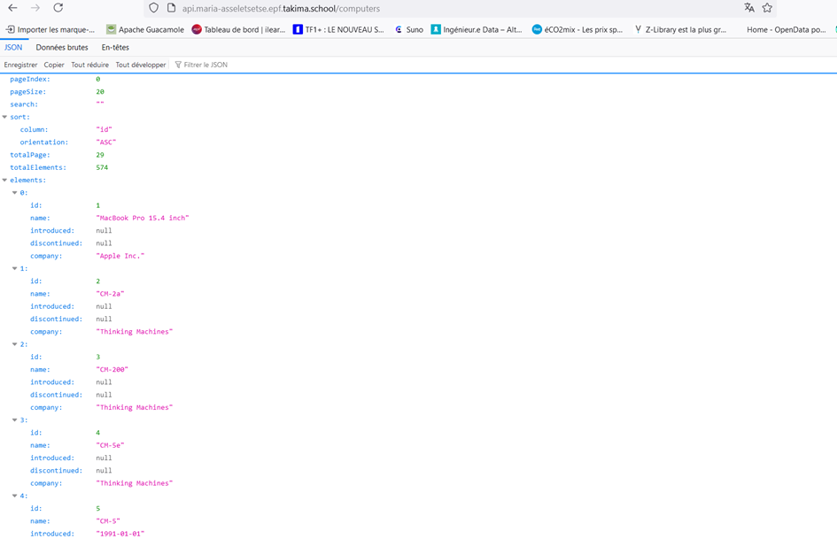

# TP2: Deep Dive - Kubernetes

## Objectif

L'objectif principal de ce TP est de déployer une architecture complète à trois niveaux (front, API et base de données) dans Kubernetes, tout en garantissant la persistance des données, la sécurité, et la haute disponibilité des services. Ce TP m'a permis de mettre en œuvre une solution de bout en bout qui inclut plusieurs bonnes pratiques de gestion de services et de déploiement dans Kubernetes.


## Étape 1: Déploiement de l'API

L'API est une application **Java Spring Boot** qui expose ses services sur le port 8080. Le premier objectif était de déployer cette API et de la rendre accessible.

### Fichiers Créés :

- **api-deployment.yaml** : Définit le déploiement de l'API avec 3 réplicas pour assurer la haute disponibilité. J'ai spécifié les limites de ressources CPU et mémoire pour optimiser l'utilisation du cluster.

- **api-service.yaml** : J'ai créé un service de type `ClusterIP` pour permettre aux autres services Kubernetes d'interagir avec l'API.

- **api-ingress.yaml** : J'ai configuré un Ingress pour exposer l'API à l'extérieur du cluster. Cela permet à des clients externes d'accéder aux services de l'API via une URL.




### Analyse des Logs
Pour surveiller l'état de l'API après le déploiement, j'ai utilisé la commande suivante pour suivre les logs des Pods :
```bash
kubectl logs -f <nom_du_pod>
```
J'ai pu observer que l'API attend la connexion à la base de données pour démarrer correctement. Cette observation nous amène à l'étape suivante : configurer et déployer la base de données.

---

## Étape 2: Déploiement de la Base de Données PostgreSQL

L'API a besoin d'une base de données relationnelle PostgreSQL pour stocker ses informations. Voici les étapes que j'ai suivies pour configurer cette base de données.

### Fichiers Créés :
- **pg-credentials.yaml** : J'ai créé un secret nommé `pg-credentials` contenant les informations d'authentification (nom d'utilisateur et mot de passe). Les valeurs sont encodées en base64 pour la sécurité.

- **pg-config.yaml** : Ce fichier ConfigMap contient le nom de la base de données `cdb-db` utilisée par PostgreSQL.

- **pg-deployment.yaml** : J'ai configuré le déploiement de PostgreSQL. Une attention particulière a été portée à l'utilisation des variables d'environnement et au montage des secrets pour permettre une connexion sécurisée.

- **pg-service.yaml** : J'ai exposé la base de données avec un service `ClusterIP` sur le port 5432, ce qui permet à l'API de s'y connecter.

- **pg-pvc.yaml** : Pour garantir la persistance des données, j'ai utilisé un Persistent Volume Claim (PVC). Cela assure que les données de la base de données ne sont pas perdues si le Pod est redémarré.

### Bonus : Connexion à PostgreSQL via kubectl
J'ai utilisé la commande `kubectl exec` pour me connecter directement à PostgreSQL et vérifier que la base de données fonctionne correctement :
```bash
kubectl exec -it <pg_pod_name> -- psql -U postgres -d cdb-db
```
J'ai pu lister les tables créées par l'API et confirmer que la base de données est prête à être utilisée.

---

## Étape 3: Connexion de l'API à la Base de Données

Pour que l'API puisse interagir avec PostgreSQL, j'ai dû configurer la connexion à la base de données en utilisant les variables d'environnement.

### Fichier Modifié :
- **api-config.yaml** : J'ai ajouté la clé `DB_ENDPOINT` au ConfigMap pour spécifier le point d'accès à la base de données. Le service PostgreSQL est accessible à partir de son nom de service et de son namespace : `postgres.database.svc.cluster.local:5432`.

- **api-deployment.yaml** : J'ai mis à jour le déploiement de l'API pour qu'elle utilise les informations de connexion fournies par le secret `pg-credentials` et le ConfigMap `api-config.yaml`.

Une fois cette étape terminée, l'API était capable de se connecter à la base de données, ce qui a permis à l'application de fonctionner correctement.

---

## Étape 4: Optimisation du Déploiement

Pour améliorer le cycle de vie et la gestion des ressources de l'application, j'ai ajouté des requests/limits adaptés ainsi que des sondes de liveness et readiness.

### Requests/Limits :
- Pour l'API : `memory: 192Mi / 256Mi`, `cpu: 100m / 200m`
- Pour la base de données : `memory: 192Mi / 256Mi`, `cpu: 100m / 1`

### Probes :
J'ai configuré les sondes suivantes pour surveiller l'état de l'API et garantir qu'elle est prête à répondre aux requêtes :
- **Liveness Probe** : `/actuator/health/liveness`
- **Readiness Probe** : `/actuator/health/readiness`

---

## Étape 5: Déploiement du Front-End

Le front-end est une application Nginx qui se connecte à l'API pour récupérer des données.

### Fichiers Créés :
- **front-config.yaml** : Ce fichier contient l'URL de l'API, nécessaire pour que le front-end puisse interagir avec elle.
- **front-deployment.yaml** : Déploiement du front-end avec les requests/limits pour optimiser l'utilisation des ressources.
- **front-service.yaml** : Exposition du front via un service interne à Kubernetes.
- **front-ingress.yaml** : Ingress permettant d'exposer le front à l'extérieur du cluster via une URL.

---

## Étape 6: Persistance dans Kubernetes

Comme les Pods Kubernetes sont stateless par défaut, j'ai utilisé un **Persistent Volume Claim (PVC)** pour garantir la persistance des données dans PostgreSQL. En cas de redémarrage du Pod, les données sont conservées grâce au volume monté dans le conteneur.

---

## Conclusion

Ce TP m'a permis de comprendre comment déployer une architecture complète dans Kubernetes en suivant les bonnes pratiques :
- Utilisation de **Persistent Volumes** pour la persistance des données.
- Sécurisation des accès avec des **Secrets** et des utilisateurs non-root.
- Mise en place de **sondes de liveness et readiness** pour surveiller les applications.
- Déploiement et gestion des services avec **Ingress** pour les exposer à l'extérieur du cluster.

J'ai également exploré l'utilisation des **StatefulSets** pour gérer des bases de données avec une meilleure persistance et possibilité de scaling.

Kubernetes offre une grande flexibilité dans la gestion des déploiements, et ce TP m'a permis de mettre en pratique plusieurs concepts avancés pour construire des applications résilientes et scalables.