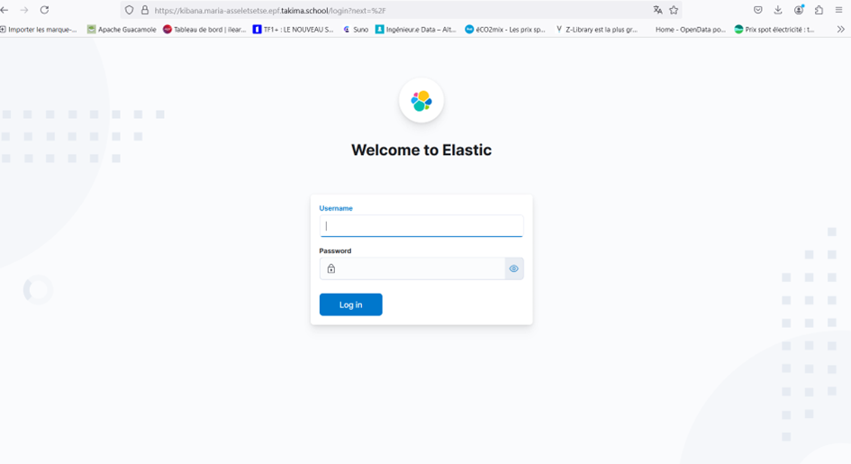

# TP3: GitOps - Kubernetes in Action

#### Objectifs :
Durant cette journée, l'objectif était de déployer une stack Elasticsearch et Kibana sur Kubernetes, puis d'apprendre à gérer des environnements de manière automatisée avec **Helm** et **ArgoCD**. Voici les étapes et le processus que j'ai suivis pour réussir ce TP.

#### Déploiement d'Elasticsearch et Kibana
1. **Création d'un dossier "elk" :**
   J'ai commencé par créer un dossier `elk` dans lequel j'ai mis mes fichiers YAML pour Elasticsearch et Kibana. J'ai ensuite édité le fichier `elasticsearch.yaml` pour déployer le cluster Elasticsearch.
   
2. **Vérification du déploiement :**
   Après avoir déployé Elasticsearch, j'ai utilisé les commandes suivantes pour vérifier le déploiement :
   ```
   kubectl get elasticsearch
   kubectl describe elasticsearch <nom-du-cluster>
   ```

3. **Déploiement de Kibana :**
   Une fois Elasticsearch en place, j'ai créé un fichier `kibana.yaml` dans le dossier `elk` pour déployer Kibana. J'ai veillé à bien lier Kibana au cluster Elasticsearch en ajoutant la référence `elasticsearchRef` manquante.

4. **Création d'un Ingress pour Kibana :**
   J'ai configuré un Ingress pour accéder à Kibana depuis mon navigateur. J'ai ajouté les annotations TLS nécessaires, car Kibana utilise TLS pour les connexions.



5. **Connexion à Kibana :**
   Une fois Kibana accessible, je me suis connecté en utilisant l'utilisateur `elastic` et le mot de passe trouvé dans le Secret `es-elastic-user`.


6. **Interaction avec Elasticsearch via Kibana :**
   J'ai utilisé les outils Dev de Kibana pour interagir avec Elasticsearch en exécutant les commandes suivantes :
   ```
   GET _cat/health?v
   GET _cat/allocation?v
   ```

7. **Mise à l'échelle du cluster Elasticsearch :**
   J'ai modifié la configuration du CRD Elasticsearch pour passer à 3 nœuds. J'ai observé la création des nouveaux Pods dans Kubernetes, puis j'ai vérifié l'état du cluster.

#### Utilisation de Helm
Helm est un outil qui permet de gérer les templates de ressources Kubernetes. Pour ce TP, j'ai dû installer **Helm** et **Git** afin de créer et gérer des chartes Helm pour notre stack applicative.

1. **Création d'un repository Git :**
   J'ai configuré un repository Git sur Gitlab pour héberger les ressources de notre application. J'ai ensuite téléchargé les premières ressources Helm et effectué un commit initial avec la commande :
   ```
   git clone https://gitlab.com/votreUser/ch3_gitops.git
   git commit -am "Init Helm resources"
   git push origin main
   ```

2. **Déploiement via Helm :**
   J'ai utilisé le fichier `values.yaml` pour définir les variables de déploiement (nom de l'application, nombre de réplicas, etc.) puis déployé l'application avec Helm :
   ```
   helm install cdb .
   ```

3. **Gestion des environnements avec Helm :**
   Helm permet de gérer plusieurs environnements grâce à des fichiers de valeurs distincts. J'ai créé un fichier `values.staging.yaml` pour configurer un environnement de pré-production.

#### Utilisation d'ArgoCD
ArgoCD est un outil de GitOps qui synchronise automatiquement l'état du cluster Kubernetes avec les fichiers dans Git. Voici les étapes que j'ai suivies pour l'utiliser :

1. **Connexion à ArgoCD :**
   Je me suis connecté à l'interface ArgoCD et j'ai ajouté mon repository Git précédemment créé.

2. **Création d'une application :**
   J'ai créé une application dans ArgoCD en spécifiant mon repository, mon chart Helm, et mon namespace. J'ai activé la synchronisation automatique pour que toute modification dans Git soit immédiatement reflétée dans le cluster.

3. **Vérification de la synchronisation :**
   J'ai testé la synchronisation en détruisant manuellement un deployment dans le cluster, et ArgoCD l'a immédiatement restauré pour s'assurer que l'état du cluster correspond toujours à celui du repository Git.

#### Questions Réponses :
1. **Que se passe-t-il lors d'un RollingUpdate ?**
   Pendant un RollingUpdate, les anciens Pods sont progressivement remplacés par de nouveaux sans interruption de service. Les anciens Pods sont supprimés uniquement lorsque les nouveaux sont opérationnels.

2. **Comment faire un Rollback ?**
   Pour effectuer un Rollback, j'ai utilisé la commande `kubectl rollout undo` qui permet de revenir à une version antérieure du déploiement.

3. **Mise à l'échelle d'une application :**
   Pour gérer un afflux important de visiteurs, j'ai augmenté le nombre de Pods en utilisant la commande `kubectl scale`. Cela permet d'ajuster dynamiquement les ressources en fonction de la demande.

4. **Pause et reprise d'un déploiement :**
   J'ai mis en pause un déploiement avec `kubectl rollout pause` pour éviter l'application de modifications non souhaitées, puis l'ai repris avec `kubectl rollout resume`.

#### Conclusion
Ce TP a été très instructif. J'ai appris à automatiser et gérer des déploiements complexes avec Helm et ArgoCD. Ces outils offrent une gestion efficace et fiable des applications dans Kubernetes, avec des capacités de mise à l'échelle, de rollback, et de gestion multi-environnements grâce à GitOps.